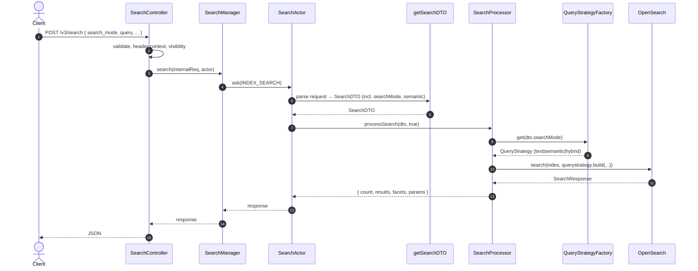
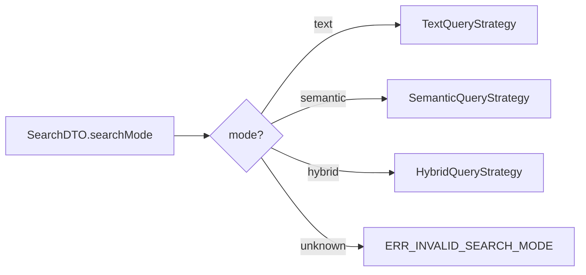
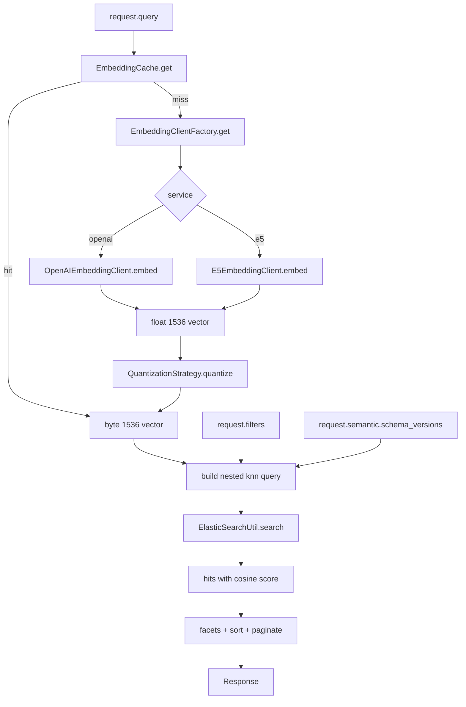
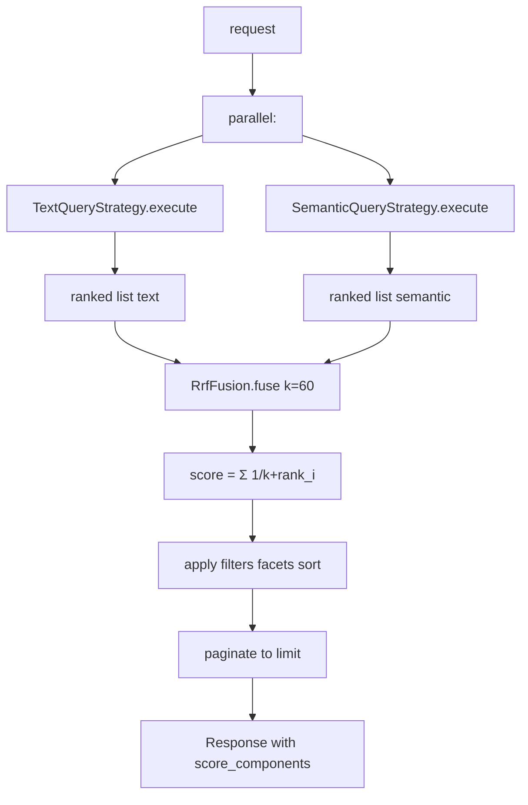
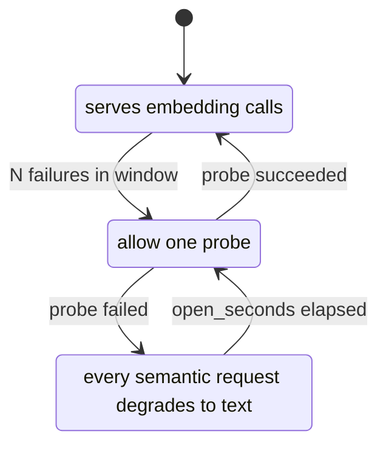
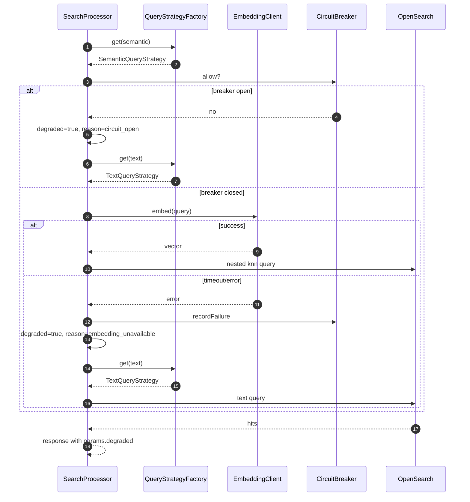
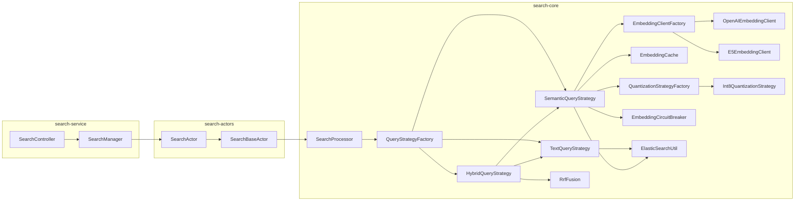

# Semantic Search — Flowcharts

Mermaid diagrams. Render in any markdown viewer that supports mermaid.

## End-to-end request flow

## Mode dispatch inside QueryStrategyFactory

## Semantic query path

## Hybrid + RRF

## Embedding circuit breaker state

## Degraded fallback

## Component dependency

